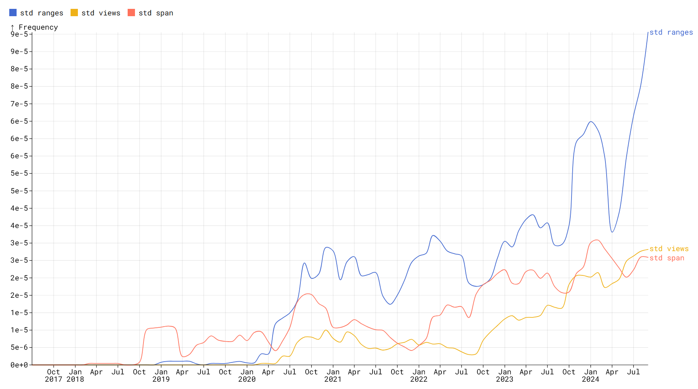

# Together C & C++ Ngrams <!-- omit in toc -->

This is a project exploring trends of words and phrases (ngrams) over time on the Together C & C++ discord server. It
was inspired by the [google books ngrams project](https://books.google.com/ngrams/).

## Table of Contents <!-- omit in toc -->

- [About](#about)
- [Privacy](#privacy)
- [Future work](#future-work)

# About

On the Together C & C++ Discord server we have built up a database of messages sent on the server since it was created
in 2017. This is something we did out of moderation necessity - we've had to inspect edit and deletion logs countless
times. Having this data, though, provides a cool opportunity for analysis of trends within the data.

This repository contains two parts: The aggregation in `src/` and the application code in `ui/` and `server/`.

The messages are stored in a MongoDB database used by the server's discord bot, [Wheatley][wheatley]. The aggregator
code reads documents from MongoDB, excluding private channels, bot ids, and deleted messages, and then tokenizes the
messages. Words are tokenized based on being any alphanumeric string of characters, allowing for `_` as well as `'` and
`-` as long as not at the edges of words. Two passes are performed over the database, the first computes totals for
given ngram sequences. Any ngram sequences that occur fewer than 40 times are excluded. This first pass uses a lot of
memory (the hash maps built up keep count of hundreds of millions of unique ngram sequences) and could be optimized
later if needed, but, for now it's fine. After this the actual aggregation pass is done which performs aggregation for
each counted ngram sequence for every month. Ngram frequency is computed simply as `count / total_tokens_for_month`.
While this simple aggregation of frequency data of short phrases from a fully public message set should not pose privacy
concerns, as a safety measure a small amount of artificial noise is added in, +/-1% uniformly. This is done with RNGs
that are seeded based on a hash of the ngrams and a secret nonce, which is very over-engineered but whatever. Monthly
frequency numbers are written to a DuckDB database which I found was far faster than Sqlite for the types of queries the
application ends up doing, glob queries that don't lend themselves to indexing. DuckDB ends up being really good at
these while Sqlite is more optimized for taking advantage of indices.

# Privacy

The data are frequencies of short phrases from messages sent in public channels in the Together C & C++ Discord server.
Messages in private channels, messages sent by bots, and deleted messages are excluded. The frequency data are monthly
aggregates for the whole server and thus is not tied to any particular user. Additionally, the following steps are taken
to further ensure privacy:

- [Discord snowflakes][snowflakes] (17 to 19 digit sequences used by discord to uniquely identify everything from users
  to channels to emojis) are filtered out. These most commonly appear in user mentions, which appear textually as
  `<@331718482485837825>`.
- Noise is added to results (+/-1%, uniformly). This is a measure inspired by [differential privacy][diff] but not using
  the same level of mathematical rigor as differential privacy is more tailored to other types of data sets.
- Any words or phrases used less than 40 times throughout the server's history are excluded.

Neither the raw nor aggregate data have been made available for download and I have no plans to change that.

# Future work

Future work on this, if I do more, will likely center around performance exploration.

[snowflakes]: https://discord.com/developers/docs/reference#snowflakes
[diff]: https://en.wikipedia.org/wiki/Differential_privacy
[wheatley]: https://github.com/TCCPP/wheatley
